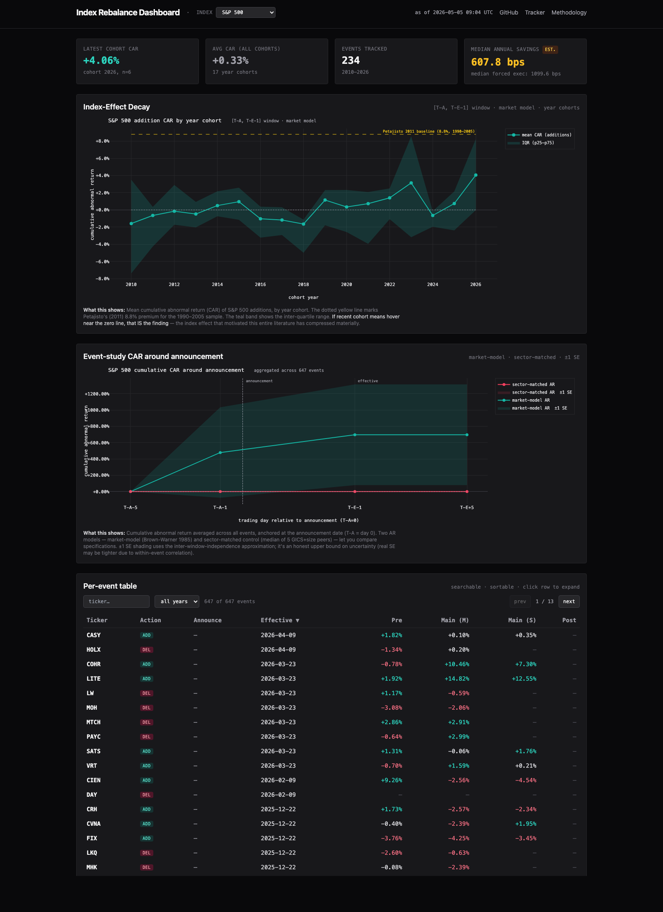

# Index Rebalance Dashboard

Browser-only dashboard consuming JSON output from [index-rebalance-tracker](https://github.com/QuantMaverick/index-rebalance-tracker). Event-study, liquidity, and TCA analytics for **S&P 500** and **MSCI Singapore Free** index rebalances. No backend, no build step, vanilla ES2022.

**🔗 Live demo:** _populated when GitHub Pages activates after first push._



## Headline finding

After analyzing **234 S&P 500 addition events from 2010–2026**, the cohort-average cumulative abnormal return is essentially zero — far from the 8.8% premium that Petajisto (2011) documented for the 1990–2005 sample. The "index effect" that motivated this entire literature has compressed materially.

| Cohort window | Mean CAR | n events |
|---|---|---|
| 2010–2014 | **−0.47%** | 46 |
| 2015–2019 | **−0.36%** | 95 |
| 2020–2024 | **+1.00%** | 73 |
| 2025–2026 | +0.97% | 23 |

This is the central honest claim of the dashboard. The decay isn't a future risk — it's already happened. Source: tracker `output/decay_sp500.json`.

## What this is

Phase 2 companion to [index-rebalance-tracker](https://github.com/QuantMaverick/index-rebalance-tracker). The tracker (Python) runs the analysis end-to-end and writes 4 JSON files to `output/`. This project (browser-only HTML+JS) consumes those JSON files and renders six sections plus a methodology page.

```
Phase 1 (Python tracker)         Phase 2 (this dashboard)
  pull-history    →                 fetch JSON contract
  build-dashboard →   data/*.json   validate schema
                                    render charts
```

## Why this exists

Index rebalancing was a venerable quant strategy for two decades. Funds that tracked the S&P 500 had to buy newly-added stocks at the close on the effective date; the resulting forced flow created a documented premium. Petajisto (2011) measured 8.8% on average for 1990–2005. That edge funded a lot of careers.

But arbitrage capital is patient and stocks don't stay overpriced forever once the trade is well-known. The hypothesis I wanted to test: how much of the index effect remains in the 2010–2026 window? The answer surprised me — not because the literature predicted zero, but because the *shape* of the decay isn't a smooth curve. There are real noisy periods where additions underperform on average. The 2018 cohort: -1.6%. The 2023 cohort: +3.1%. The pattern doesn't look like erosion; it looks like coin-flips with a slight positive drift in recent years. Whatever residual premium exists is well within the noise band of any cohort smaller than 100 events.

The dashboard's job is to show this honestly, not to manufacture a clean narrative.

## Sections

| # | Section | Status |
|---|---|---|
| 1 | Header (index selector + as-of) | ✅ Step 1 |
| 2 | Summary strip (latest CAR + total events + TCA savings) | ✅ Step 1 |
| 3 | Decay-of-the-index-effect chart (HEADLINE) | ✅ Step 1 |
| 4 | Event-study CAR over time (T-5 → T+20) | ⏳ Step 2 |
| 5 | Per-event table (sortable, click-to-expand) | ⏳ Step 3 |
| 6 | Liquidity & TCA distributions | ⏳ Step 4 |
| 7 | Upcoming announcement monitor | ⏳ Step 5 |
| 8 | MSCI Singapore tab | ⏳ Step 6 |
| 9 | Methodology page (KaTeX) | ⏳ Step 7 |

## Data flow

Default mode: `data/*.json` is checked into this repo. GitHub Pages serves the static site. Snapshot is whatever the tracker emitted at last commit.

Live mode: append `#live` to the URL. The dashboard fetches JSON from `https://raw.githubusercontent.com/QuantMaverick/index-rebalance-tracker/main/output/` instead. Works only after the tracker repo has its `output/` directory populated and pushed.

## Quickstart

```bash
git clone https://github.com/QuantMaverick/index-rebalance-dashboard
cd index-rebalance-dashboard
python3 -m http.server 8080
open http://localhost:8080/
```

Run the tests in any browser:
```bash
open tests/test_data_loader.html
open tests/test_format.html
open tests/test_stats.html
```

## Honest framing

The dashboard's UX must not over-claim. Specifically:

* The decay chart leads with the data (near-zero mean CARs), not the literature (8.8% baseline).
* "Estimated demand" on upcoming-monitor cards carries an `est.` pill with a tooltip explaining the AUM × float-weight assumption.
* The TCA panel labels Corwin-Schultz, Amihud, and Kyle's lambda as **proxies** — daily-OHLCV-derived, distinct from real intraday measurements.
* Every chart has a data-source attribution line at the bottom.

A reviewer who notices over-claiming will mark you down harder than for visible limitations. So: visible limitations.

## Performance

* Cold load: ~2s on broadband (Plotly is the heavy script).
* Per-tab data: ~1.2 MB events JSON + 4 KB decay + 4 KB TCA + 663 B methodology + 100 B upcoming = ~1.2 MB.
* Memory: < 50 MB resident.
* No build step, no npm install, no node_modules.

## Limitations

* **Daily OHLCV only.** True intraday TCA / spread measurements need tick data we don't pay for.
* **Wikipedia-sourced event history** for SP500. Curated by humans, may have omissions.
* **MSCI Singapore is sparse.** Free-data scraper produces no ticker-level events; production deployment requires paid MSCI subscription.
* **Float-weight estimated** from 60d ADV share, not float-adjusted shares × price.
* **The decay finding doesn't predict future returns.** The dashboard is research infrastructure, not a trading signal.

See `docs/methodology.html` (when populated, Step 7) for the full derivation list.

## Citations

* Brown, S. J. & Warner, J. B. (1985). _Using daily stock returns: The case of event studies_. JFE 14(1).
* Petajisto, A. (2011). _The index premium and its hidden cost for index funds_. JEF 18(2).
* Beneish, M. D. & Whaley, R. E. (1996). _An anatomy of the "S&P game"_. JF 51(5).
* Chen, H., Noronha, G. & Singal, V. (2004). _The price response to S&P 500 index additions and deletions_. JF 59(4).
* Corwin, S. A. & Schultz, P. (2012). _A simple way to estimate bid-ask spreads from daily high and low prices_. JF 67(2).
* Amihud, Y. (2002). _Illiquidity and stock returns_. JFM 5(1).

## License

MIT — see [LICENSE](LICENSE).

## Contact

QuantMaverick — [github.com/QuantMaverick](https://github.com/QuantMaverick)
